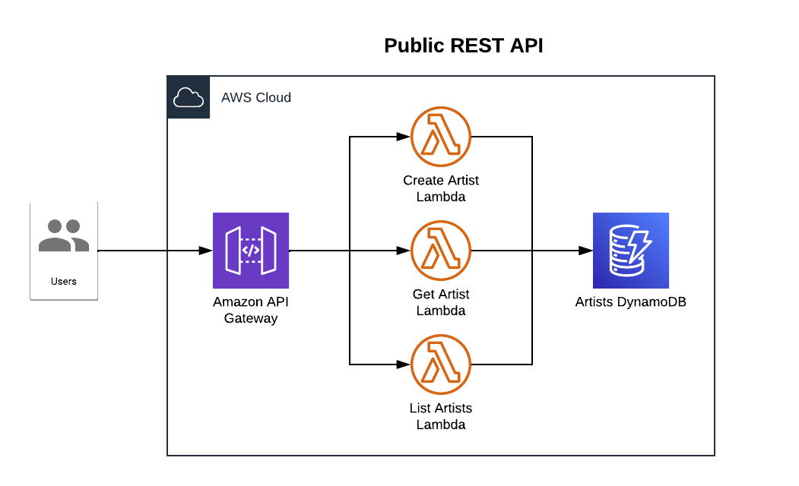

# The Public REST API

This is an example CDK stack to deploy Public REST API stack with TypeScript.  
It purpose is to expose an API to public customers. 



## Prerequisites

* Setup the `base-infra` your AWS Account
* Setup Azure DevOps service connections to your AWS account
* Find and validate all TODO's in this repository (`// TODO:`) 
* Setup access to NS Nexus package manager. Create a `~/.npmrc` with your [credentials](https://nexus.topaas.ns.nl/#user/usertoken) in base64 representation:
```bash
registry=https://registry.npmjs.org
@ns:registry='https://nexus.topaas.ns.nl/repository/NS_NSCAWS_CDK'
//nexus.topaas.ns.nl/repository/NS_NSCAWS_CDK:_auth='<<INSERT YOUR PERSONAL BASE64 TOKEN>>'
```

## Getting started


## Useful commands

* `npm run build`   compile typescript to js
* `npm run test`    perform the jest unit tests
* `cdk synth`       emits the synthesized CloudFormation template
* `cdk deploy`      deploy this stack to your default AWS account/region

## Available Versions

* [TypeScript](typescript/)
* [GraalVM](graalvm/)

## More information
* [How to get started with Azure API Management]()
* [Serverless Applications Lens - AWS Well-Architected Framework](https://docs.aws.amazon.com/wellarchitected/latest/serverless-applications-lens/welcome.html)